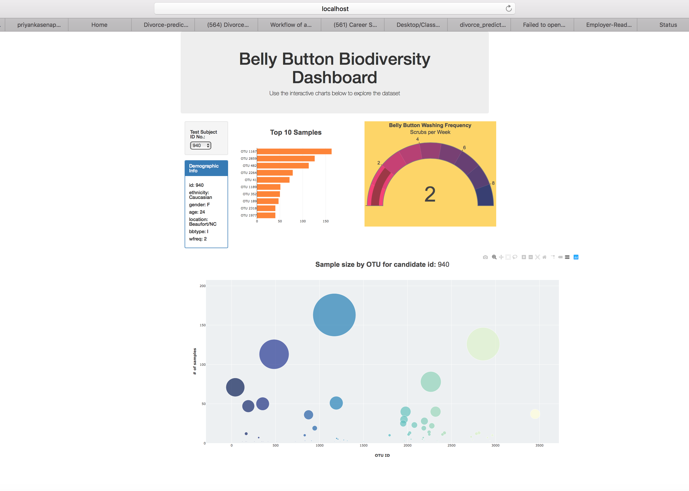

# Priyanka_Module-12_Plotly-Belly-Button-Biodiversity
** Project Overview:
Develop a Dashboard for displaying Belly Button Bacterial data of volunteers selected using a drop-down menu. The information displayed for each should be as follows:
1. Demographic info
2. Bar chart with top ten bacterial species in sample
3. Bubble chart to visualize frequency of bacteria found in sample
Gauge showing the frequency that the bellybutton is scrubbed weekly can be optionally provided.

** You can find the completed website here:
As Dashboard is deployed to GitHub Pages for access to data on any computer.
https://priyankasenapati.github.io/Priyanka_Module-12_Plotly-Belly-Button-Biodiversity/.

** Technology and Resources:
The following technologies and resources were used for implementing this project.
* Software: JavaScript ES6+, Plotly, Bootstrap, VSCode 1.42.1, Chrome: 76.0.3809.146, OS: OSX Darwin x64 17.7.0
* Data Source (provided): samples.json
* Color Theme: Pantone 2019
Image:

